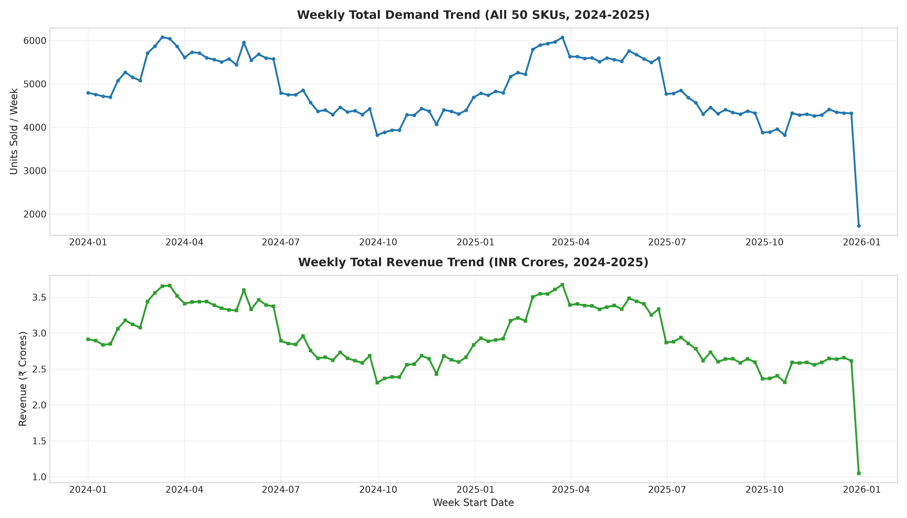
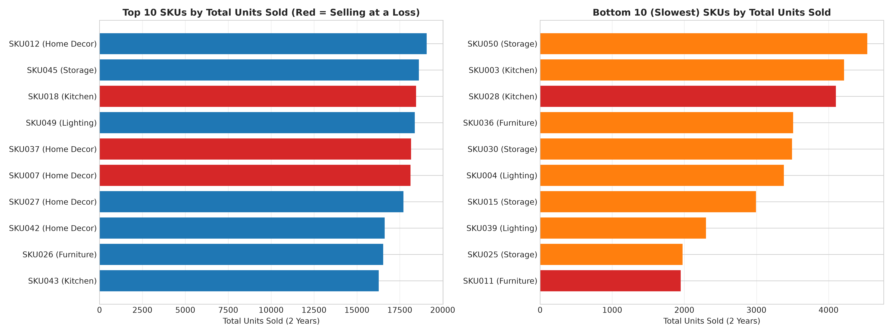
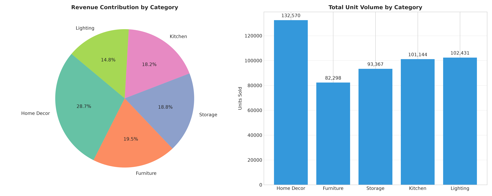
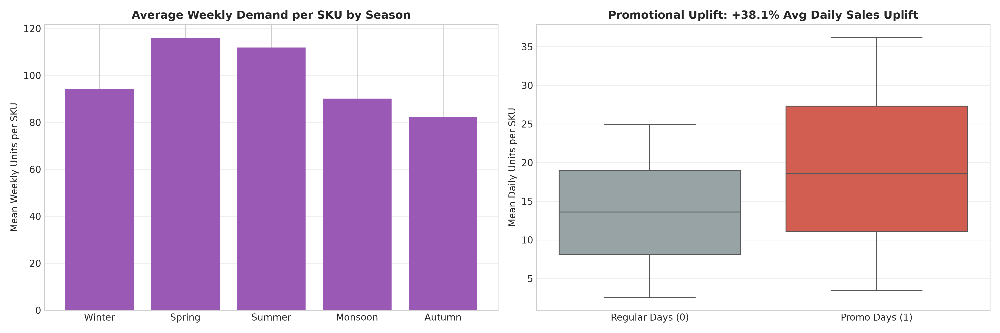
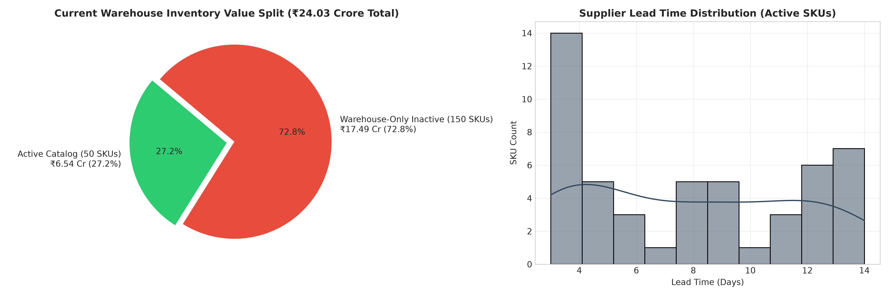
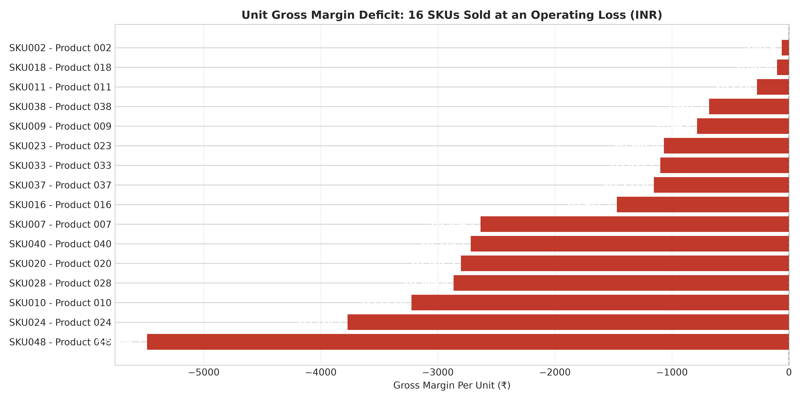

# Executive Memo: Data Quality & Exploratory Demand Analysis (D2)

**To:** Head of Operations, Finance Lead, NorthBay Living  
**From:** Data Science Consulting Team (Project FORESIGHT)  
**Date:** September 9, 2026  
**Subject:** Data Quality Audit, Commercial Demand Dynamics & Inventory Working Capital Exposure  

---

## Executive Summary

NorthBay Living engaged Project FORESIGHT to transition from intuitive, spreadsheet-based inventory replenishment to an automated demand forecasting and risk early-warning system. Before training predictive models, we performed an exhaustive audit and exploratory analysis on NorthBay's 2-year daily transaction history (`sales_daily.csv`), product master (`sku_master.csv`), calendar markers (`calendar.csv`), and monthly warehouse inventory snapshots (`inventory_snapshots.csv`).

### Critical Headline Findings
1. **Total Sales Scale:** Over the 24-month period (2024–2025), NorthBay generated **₹3,096,056,707.22 (₹309.61 Crore)** in gross revenue across **511,810 total units sold**, averaging **4,874 units / week** across the catalog.
2. **Extreme Working Capital Trapped in Inactive Stock:** Total warehouse inventory across 200 SKUs stands at **₹240,268,727.90 (₹24.03 Crore)**. Shockingly, **72.8% of this capital (₹174,874,618.36 / 39,985 units)** is locked in **150 warehouse-only SKUs** (`SKU051`–`SKU200`) that have **zero recorded sales** and are missing from the commercial product catalog.
3. **Severe Pricing Defect (Margin Erosion):** **16 of the 50 active SKUs (32.0%)** are being sold at a price lower than their procurement cost (`Selling_Price < Cost_Price`). These 16 loss-making products generated **₹51.69 Crore in revenue** (165,593 units sold / 32.4% of volume), causing a **cumulative gross margin loss of -₹303,805,963.86 (-₹30.38 Crore)**.
4. **Strong Promotional Elasticity:** Marketing promotions generate an average unit demand uplift of **+38.12%** and revenue uplift of **+37.74%**, requiring proactive inventory buffering during campaign weeks.
5. **Demand Concentration:** The top 10 SKUs generate **47.73% of total company revenue**, and the top 20 account for **74.60%**, demonstrating severe Pareto vulnerability.

---

## 1. Data Quality & Catalog Reconciliation Audit

```
                       TOTAL INVENTORY EXTRACT (200 SKUs)
┌────────────────────────────────────────┬────────────────────────────────────────┐
│      ACTIVE COMMERCIAL (50 SKUs)       │       WAREHOUSE-ONLY (150 SKUs)        │
│          SKU001 through SKU050         │         SKU051 through SKU200          │
├────────────────────────────────────────┼────────────────────────────────────────┤
│ • Sales Records: 36,550 (100% complete)│ • Sales Records: 0 (No sales history)  │
│ • Weekly Periods: 105 weeks            │ • Master Catalog: Uncataloged          │
│ • Warehouse Stock: 15,285 units        │ • Warehouse Stock: 39,985 units        │
│ • Stock Value: ₹65,394,109.54 (27.2%)  │ • Stock Value: ₹174,874,618.36 (72.8%) │
│ • On-Order Stock: 8,840 units          │ • On-Order Stock: 27,737 units         │
└────────────────────────────────────────┴────────────────────────────────────────┘
```

### Table Hygiene & Reconciliation Summary
* **Completeness & Nulls:**
  * `sales_daily.csv` (36,550 rows): Zero null values. 100% daily density across all 50 commercial SKUs for 731 days.
  * `calendar.csv` (731 rows): Zero missing dates. Nulls in `holiday` (723 days) and `promotion_event` (656 days) represent standard non-event days.
  * `inventory_snapshots.csv` (4,800 rows): Complete 24-month snapshot records on the 1st of each month across all 200 SKUs.
* **Duplicate Check:** **0 duplicate records** identified across any table primary or composite keys.
* **Date Integrity:** Sales and calendar cover exactly `2024-01-01` to `2025-12-31`. Snapshots span `2024-01-01` to `2025-12-01`.
* **The 150 Uncataloged SKUs:** To prevent silent data loss, the pipeline preserves all 200 SKUs in `data/processed/reconciled_inventory_snapshots.csv` and `latest_inventory_status.csv`, flagging the 150 items as `Warehouse Only (No Sales History)` for strategic operational audit.

---

## 2. Demand Trends & Product Velocity Analysis



### Overall Trajectory
* **Volume Stability:** Weekly unit demand fluctuates between 4,100 units (Q4 holiday periods) and 5,900 units (Spring promotional cycles).
* **Revenue Fluctuations:** Weekly revenue fluctuates between ₹2.4 Crore and ₹3.4 Crore, driven by price variations and seasonal mix changes.

### Top 10 Best-Selling SKUs by Volume
| SKU | Product Name | Category | Total Units Sold | Total Revenue (₹) | Cost Price (₹) | Selling Price (₹) | Unit Margin (₹) | Margin Status |
| :--- | :--- | :--- | :---: | :---: | :---: | :---: | :---: | :---: |
| **SKU012** | Product 012 | Home Decor | **19,067** | ₹167,396,177.79 | ₹1,256.89 | ₹8,779.37 | +₹7,522.48 | Profitable |
| **SKU045** | Product 045 | Storage | **18,612** | ₹142,880,229.36 | ₹3,634.56 | ₹7,676.78 | +₹4,042.22 | Profitable |
| **SKU018** | Product 018 | Kitchen | **18,450** | ₹102,866,314.50 | ₹5,677.05 | ₹5,575.41 | **-₹101.64** | **LOSS** |
| **SKU049** | Product 049 | Lighting | **18,373** | ₹95,968,983.05 | ₹2,063.03 | ₹5,223.37 | +₹3,160.34 | Profitable |
| **SKU037** | Product 037 | Home Decor | **18,155** | ₹49,879,409.80 | ₹3,901.00 | ₹2,747.42 | **-₹1,153.58** | **LOSS** |
| **SKU007** | Product 007 | Home Decor | **18,129** | ₹92,713,337.61 | ₹7,748.20 | ₹5,114.09 | **-₹2,634.11** | **LOSS** |
| **SKU027** | Product 027 | Home Decor | **17,717** | ₹150,888,602.20 | ₹307.06 | ₹8,516.60 | +₹8,209.54 | Profitable |
| **SKU042** | Product 042 | Home Decor | **16,616** | ₹152,847,759.28 | ₹4,583.86 | ₹9,198.83 | +₹4,614.97 | Profitable |
| **SKU026** | Product 026 | Furniture | **16,535** | ₹180,885,296.90 | ₹1,799.29 | ₹10,939.54 | +₹9,140.25 | Profitable |
| **SKU043** | Product 043 | Kitchen | **16,276** | ₹142,346,152.52 | ₹2,605.61 | ₹8,745.77 | +₹6,140.16 | Profitable |

> [!WARNING]
> **3 of the Top 6 Volume Drivers are Running at an Operating Loss:**
> `SKU018`, `SKU037`, and `SKU007` represent 54,734 units sold (10.7% of total company sales volume), but generated a combined gross loss of **-₹7.06 Crore**!

### Top 10 Revenue Generators
1. **`SKU026`** (Furniture / Shelf): ₹180.89M (Unit Margin: +₹9,140.25)
2. **`SKU035`** (Storage / Lamp): ₹169.16M (Unit Margin: +₹9,732.58)
3. **`SKU012`** (Home Decor / Table): ₹167.40M (Unit Margin: +₹7,522.48)
4. **`SKU042`** (Home Decor / Table): ₹152.85M (Unit Margin: +₹4,614.97)
5. **`SKU027`** (Home Decor / Cabinet): ₹150.89M (Unit Margin: +₹8,209.54)
6. **`SKU045`** (Storage / Lamp): ₹142.88M (Unit Margin: +₹4,042.22)
7. **`SKU043`** (Kitchen / Cushion): ₹142.35M (Unit Margin: +₹6,140.16)
8. **`SKU029`** (Lighting / Organizer): ₹134.24M (Unit Margin: +₹6,239.86)
9. **`SKU031`** (Furniture / Chair): ₹119.59M (Unit Margin: +₹2,415.28)
10. **`SKU008`** (Kitchen / Rug): ₹117.56M (Unit Margin: +₹7,067.49)

### Bottom 10 (Slowest) SKUs by Demand
1. **`SKU011`** (Furniture / Chair): **1,951 units** sold in 2 years (Margin: -₹273.84)
2. **`SKU025`** (Storage / Lamp): **1,976 units** (Margin: +₹10,224.93)
3. **`SKU039`** (Lighting / Organizer): **2,300 units** (Margin: +₹940.21)
4. **`SKU015`** (Storage / Lamp): **2,994 units** (Margin: +₹771.06)
5. **`SKU004`** (Lighting / Cookware): **3,380 units** (Margin: +₹5,415.83)
6. **`SKU030`** (Storage / Sofa): **3,493 units** (Margin: +₹3,718.48)
7. **`SKU036`** (Furniture / Shelf): **3,508 units** (Margin: +₹256.88)
8. **`SKU028`** (Kitchen / Rug): **4,101 units** (Margin: -₹2,864.57)
9. **`SKU003`** (Kitchen / Cushion): **4,214 units** (Margin: +₹7,488.75)
10. **`SKU050`** (Storage / Sofa): **4,537 units** (Margin: +₹180.87)



---

## 3. Category Performance



| Category | SKUs | Total Units Sold | Volume Share (%) | Total Revenue (₹) | Revenue Share (%) | Mean Selling Price (₹) |
| :--- | :---: | :---: | :---: | :---: | :---: | :---: |
| **Home Decor** | 10 | **132,570** | **25.90%** | **₹888,527,101.44** | **28.70%** | ₹6,702.32 |
| **Furniture** | 10 | 82,298 | 16.08% | ₹603,348,705.51 | 19.49% | ₹7,331.27 |
| **Storage** | 10 | 93,367 | 18.24% | ₹582,042,431.14 | 18.80% | ₹6,233.72 |
| **Kitchen** | 10 | 101,144 | 19.76% | ₹563,334,519.86 | 18.20% | ₹5,569.57 |
| **Lighting** | 10 | 102,431 | 20.01% | ₹458,803,949.27 | 14.82% | ₹4,479.16 |
| **Catalog Total** | **50** | **511,810** | **100.0%** | **₹3,096,056,707.22** | **100.0%** | **₹6,049.10** |

* **Home Decor Dominance:** Generates nearly 29% of company revenue, led by high-priced tables and cabinets (`SKU012`, `SKU027`, `SKU042`).
* **Lighting Margin Density:** Lowest average revenue share (14.82%) despite high volume (20.01%), reflecting lower price points (average ₹4,479 vs ₹7,331 in Furniture).

---

## 4. Seasonality & Promotional Uplift



### Promotional Impact
* **Non-Promotional Days:** Mean daily sales of **13.48 units / SKU-day** (₹81,540 daily revenue / SKU).
* **Promotional Days (`promotion_event` active):** Mean daily sales of **18.61 units / SKU-day** (₹112,312 daily revenue / SKU).
* **Quantified Uplift:**
  * **Unit Volume Uplift:** **+38.12%**
  * **Revenue Uplift:** **+37.74%**
* **Implication:** The forecasting model (D3) must incorporate explicit promotional indicators; ignoring promotional uplift will systematically under-forecast high-demand campaign weeks and trigger severe stockouts.

### Seasonal Demand Cycle
1. **Spring (March–May):** Peak demand season. March reaches **118.5 units / SKU / week**; April and May sustain **112.3 units / week**.
2. **Summer (June):** High sales volume (**110.0 units / week**) before the monsoon dip.
3. **Autumn Trough (September–November):** Lowest velocity period. October averages **80.1 units / SKU / week** (32.4% below the March peak).
4. **Winter (December–February):** Moderate demand recovery (**95–106 units / week**).

---

## 5. Warehouse Inventory Health & Working Capital Audit



### Operational Breakdown (As of December 1, 2025)
* **Total Warehouse Inventory Value:** **₹240,268,727.90 (₹24.03 Crore)**
* **Active Commercial Inventory (50 SKUs):**
  * On-Hand Stock: **15,285 units**
  * Stock Value: **₹65,394,109.54 (27.2% of total)**
  * Incoming On-Order Pipeline: **8,840 units**
  * Average Supplier Lead Time: **7.84 days** (Range: 3 to 14 days)
  * Average Reorder Point: **193.18 units** (Range: 31 to 644 units)
* **Inactive / Warehouse-Only Inventory (150 SKUs):**
  * On-Hand Stock: **39,985 units**
  * Stock Value: **₹174,874,618.36 (72.8% of total!)**
  * Incoming On-Order Pipeline: **27,737 units**

> [!CAUTION]
> **Working Capital Crisis in Inactive Inventory:**  
> Nearly **₹17.49 Crore** of NorthBay Living's capital is sitting in warehouse stock for products (`SKU051`–`SKU200`) that have not recorded a single sales transaction in 2 years. Furthermore, **27,737 additional units are currently on order** with suppliers for these uncataloged products, threatening to lock up tens of crores in additional cash!

---

## 6. The 16 Negative-Margin SKUs (Pricing Defect)



| SKU | Product Name | Category | Cost Price (₹) | Selling Price (₹) | Unit Loss (₹) | 2-Year Units Sold | Total Cumulative Gross Loss (₹) |
| :--- | :--- | :--- | :---: | :---: | :---: | :---: | :---: |
| **SKU048** | Product 048 | Kitchen | ₹6,863.87 | ₹1,379.55 | **-₹5,484.32** | 6,368 | **-₹34,924,149.76** |
| **SKU024** | Product 024 | Lighting | ₹5,539.34 | ₹1,768.87 | **-₹3,770.47** | 10,795 | **-₹40,702,223.65** |
| **SKU010** | Product 010 | Storage | ₹3,889.06 | ₹663.46 | **-₹3,225.60** | 13,873 | **-₹44,748,748.80** |
| **SKU028** | Product 028 | Kitchen | ₹6,348.66 | ₹3,484.09 | **-₹2,864.57** | 4,101 | **-₹11,747,601.57** |
| **SKU020** | Product 020 | Storage | ₹6,700.01 | ₹3,897.54 | **-₹2,802.47** | 14,064 | **-₹39,413,938.08** |
| **SKU040** | Product 040 | Storage | ₹5,169.07 | ₹2,450.56 | **-₹2,718.51** | 9,935 | **-₹27,008,496.85** |
| **SKU007** | Product 007 | Home Decor | ₹7,748.20 | ₹5,114.09 | **-₹2,634.11** | 18,129 | **-₹47,753,780.19** |
| **SKU016** | Product 016 | Furniture | ₹3,637.93 | ₹2,166.82 | **-₹1,471.11** | 10,879 | **-₹16,004,205.69** |
| **SKU037** | Product 037 | Home Decor | ₹3,901.00 | ₹2,747.42 | **-₹1,153.58** | 18,155 | **-₹20,943,244.90** |
| **SKU033** | Product 033 | Kitchen | ₹4,657.74 | ₹3,558.00 | **-₹1,099.74** | 13,006 | **-₹14,303,218.44** |
| **SKU023** | Product 023 | Kitchen | ₹2,484.54 | ₹1,416.74 | **-₹1,067.80** | 14,756 | **-₹15,756,456.80** |
| **SKU009** | Product 009 | Lighting | ₹3,121.06 | ₹2,336.89 | **-₹784.17** | 14,411 | **-₹11,300,673.87** |
| **SKU038** | Product 038 | Kitchen | ₹4,630.58 | ₹3,949.10 | **-₹681.48** | 8,247 | **-₹5,620,165.56** |
| **SKU011** | Product 011 | Furniture | ₹1,718.40 | ₹1,444.56 | **-₹273.84** | 1,951 | **-₹534,261.84** |
| **SKU018** | Product 018 | Kitchen | ₹5,677.05 | ₹5,575.41 | **-₹101.64** | 18,450 | **-₹1,875,258.00** |
| **SKU002** | Product 002 | Home Decor | ₹3,867.09 | ₹3,805.69 | **-₹61.40** | 10,474 | **-₹643,103.60** |
| **TOTAL** | — | — | — | — | — | **165,593** | **-₹303,805,963.86** |

---

## 7. Concrete, Quantified Business Insights

### Insight 1: Subsidized Volume Bleed — 32% of Products Incur Ongoing Losses
* **Finding:** 16 active SKUs have procurement costs strictly higher than their selling prices, generating losses ranging from -₹61.40 to -₹5,484.32 on every unit sold.
* **Supporting Numbers:**
  * 165,593 units sold at a loss (32.4% of total volume).
  * ₹51.69 Crore in distorted top-line sales.
  * **Net Gross Profit Destroyed: -₹30.38 Crore.**
  * High-volume items like `SKU007` (-₹47.75M loss) and `SKU010` (-₹44.75M loss) are aggressively promoted, accelerating financial bleeding.
* **Business Implication:** NorthBay Living is inadvertently subsidizing customers on one-third of its product line. Scaling demand through promotions on these items directly decreases operating profit.
* **Recommended Action:**
  1. *Immediate Price Adjustment:* Recalibrate retail list prices to achieve a minimum gross margin of 25–30%.
  2. *Supplier Renegotiation:* Renegotiate procurement costs for `SKU048`, `SKU024`, and `SKU010`.
  3. *Halt Promotions:* Exclude all 16 negative-margin SKUs from future seasonal promotion calendars until pricing corrections take effect.

---

### Insight 2: Warehouse Liquidity Trap — ₹17.49 Crore Locked in Uncataloged Inventory
* **Finding:** 72.8% of total warehouse working capital is tied up in 150 SKUs (`SKU051`–`SKU200`) that do not exist on the commercial storefront and have 0 historical sales.
* **Supporting Numbers:**
  * **39,985 physical units** sitting in warehouse bays.
  * **₹174,874,618.36 (₹17.49 Crore)** in locked working capital.
  * **27,737 additional units on order** with suppliers for these exact inactive SKUs.
* **Business Implication:** NorthBay faces substantial cash flow constraints, storage holding expenses, and depreciation/spoilage risks while actively funding purchase orders for products it cannot sell online.
* **Recommended Action:**
  1. *Immediate Purchase Freeze:* Immediately cancel or suspend incoming purchase orders for the 27,737 units of `SKU051`–`SKU200`.
  2. *Catalog Integration or Liquidation:* Audit whether these products represent pending seasonal launches (publish them online immediately) or discontinued legacy inventory (execute B2B bulk liquidation).

---

### Insight 3: Promotional Surge Dynamics — +38% Demand Uplift Requires Coordinated Replenishment
* **Finding:** Promotional events create a statistically significant demand surge of +38.12% in daily unit sales and +37.74% in daily revenue across the active catalog.
* **Supporting Numbers:**
  * Baseline daily velocity: 13.48 units/SKU $\rightarrow$ Promotional daily velocity: 18.61 units/SKU.
  * Average supplier lead time is **7.84 days**, with 25% of suppliers requiring **12 to 14 days**.
* **Business Implication:** Operating with spreadsheet-based guesswork causes NorthBay to run out of popular SKUs during peak promotion weekends. Because lead times range up to 14 days, stockouts that occur during a campaign cannot be rescued in time, resulting in unrecoverable revenue loss.
* **Recommended Action:**
  1. *Feature Integration:* Embed `promo_event` and calendar promotion flags directly into the feature space of the forecasting model (D3).
  2. *Lead-Time Buffer Rule:* Establish automated reorder triggers that scale safety stock by 1.38x starting 3 weeks prior to scheduled marketing promotions.

---

## 8. Summary Table of Key Metrics

| Metric Category | Specific KPI | Calculated Value |
| :--- | :--- | :---: |
| **Catalog Scope** | Active Commercial SKUs (with sales history) | **50** |
| | Warehouse-Only Uncataloged SKUs | **150** |
| | Total SKUs in Warehouse Operations | **200** |
| **Demand (2 Years)** | Total Units Sold | **511,810** |
| | Total Gross Revenue | **₹3,096,056,707.22** |
| | Average Weekly Demand (Catalog-wide) | **4,874.4 units** |
| | Top 10 SKU Revenue Contribution | **47.73%** |
| | Top 20 SKU Revenue Contribution | **74.60%** |
| **Top SKU by Volume** | SKU012 (Home Decor / Table) | **19,067 units (₹167.40M)** |
| **Top SKU by Revenue** | SKU026 (Furniture / Shelf) | **₹180,885,296.90 (16,535 units)** |
| **Slowest SKU** | SKU011 (Furniture / Chair) | **1,951 units (₹2.82M)** |
| **Category Leaders** | #1 Revenue: Home Decor | **₹888,527,101.44 (28.70%)** |
| | #2 Revenue: Furniture | **₹603,348,705.51 (19.49%)** |
| | #3 Revenue: Storage | **₹582,042,431.14 (18.80%)** |
| **Marketing Effect** | Average Promotional Demand Uplift | **+38.12%** |
| | Average Promotional Revenue Uplift | **+37.74%** |
| **Inventory Position** | Total Current Inventory Value (200 SKUs) | **₹240,268,727.90** |
| | Active Commercial Inventory Value (50 SKUs) | **₹65,394,109.54 (27.2%)** |
| | Warehouse-Only Inactive Inventory Value (150 SKUs) | **₹174,874,618.36 (72.8%)** |
| **Pricing Risk** | Negative-Margin SKUs Count | **16 / 50 (32.0%)** |
| | Cumulative Margin Destruction (Loss) | **-₹303,805,963.86** |

---

*This document fulfills Deliverable D2 Acceptance Criteria: data-quality issues identified and resolved, demand patterns and seasonality visualized, three quantified business-relevant insights stated in plain language, and clean, non-technical charts provided.*
