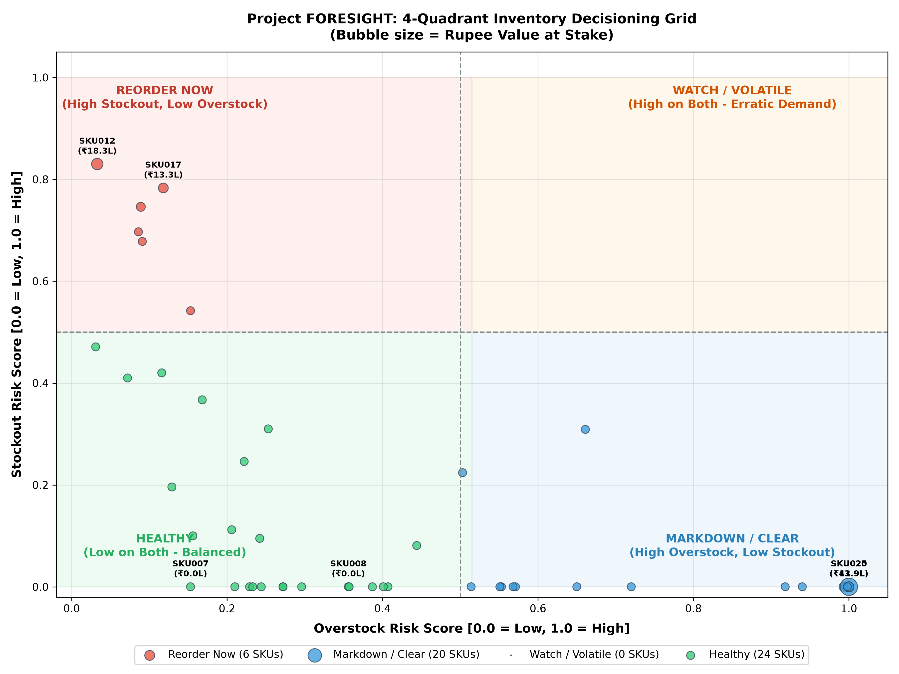

# Operational Memo: Inventory Risk Scoring & Decisioning Grid (Deliverable D4)

**To:** Head of Operations, Merchandiser, Finance Lead, NorthBay Living  
**From:** Data Science Consulting Team (Project FORESIGHT)  
**Date:** September 9, 2026  
**Subject:** Forecast-Driven 4-Quadrant Stockout & Overstock Risk Engine with Rupee Exposure Quantification  

---

## Executive Summary

To transition NorthBay Living from static spreadsheet heuristics to dynamic, predictive inventory management, Project FORESIGHT developed the **Inventory Risk Scoring & Decisioning Engine (Deliverable D4)**. The engine couples forward demand forecasts generated by the production machine learning model (`HistGradientBoostingRegressor`) with multi-echelon warehouse inventory positions (`Current_Stock` and `On_Order`) as of December 1, 2025.

Per operational review, the primary stockout risk methodology connects the forward demand forecast directly to supplier lead times and safety stocks, replacing static reorder-point breaches as the primary trigger while retaining physical warehouse thresholds as secondary explanatory indicators.

### Key Headline Results (50 Active Commercial SKUs)

* **Reorder Now (High Stockout Risk, Low Overstock Risk):** **6 SKUs (12.0%)** face imminent buffer breach during supplier lead time. Total available inventory (`Current_Stock + On_Order`) falls short of the required buffer (`lead_time_demand + Safety_Stock`), creating an aggregate buffer deficit of **660.2 units** and placing **₹45,17,903.87 (₹45.18 Lakhs)** in potential revenue at risk.
* **Markdown / Clear (Low Stockout Risk, High Overstock Risk):** **20 SKUs (40.0%)** hold physical inventory exceeding their 4-week forward demand forecast, locking up **4,456.0 excess units** worth **₹1,34,30,492.25 (₹1.34 Crores)** in operational working capital.
* **Watch / Volatile (High on Both):** **0 SKUs (0.0%)**. No active commercial SKU currently exhibits simultaneous buffer breach and 4-week holding excess.
* **Healthy (Balanced Inventory):** **24 SKUs (48.0%)** maintain inventory positions that safely cover forward lead-time demand without exceeding 4-week holding limits.
* **Total Rupee Value at Stake (Active Catalog):** **₹1,79,48,396.12 (₹1.79 Crores)**, comprising ₹45.18 Lakhs in potential revenue exposure and ₹1.34 Crores in active excess working capital tied up.
* **Warehouse-Only Inactive Catalog (150 SKUs):** Holds **₹17,48,74,618.36 (₹17.49 Crores)** in non-moving inventory with zero sales history over 2 years, requiring strategic executive liquidation.

---

## 1. Risk Methodology & Mathematical Formulations

```
       Stockout Risk Score 
           (1.0) ▲
                 │
                 │   REORDER NOW (6 SKUs)         │   WATCH / VOLATILE (0 SKUs)
                 │   • Available < Required Buffer│   • High buffer deficit
                 │   • No 4-week excess stock     │   • Stock > 4-week demand
                 │   • Action: Prioritize PO      │   • Action: Investigate
           (0.5) ┼────────────────────────────────┼───────────────────────────────
                 │   HEALTHY (24 SKUs)            │   MARKDOWN / CLEAR (20 SKUs)
                 │   • Available >= Buffer        │   • Available >= Buffer
                 │   • Stock <= 4-week demand     │   • Stock > 4-week demand
                 │   • Action: Maintain & Monitor │   • Action: Promotional Markdown
           (0.0) └────────────────────────────────┴───────────────────────────────►
               (0.0)                            (0.5)                          (1.0)
                                                    Overstock Risk Score
```

### A. Primary Forecast-Driven Stockout Risk Definition

The primary stockout risk logic evaluates whether total available inventory can fulfill customer demand during the supplier replenishment lead time while safeguarding the safety stock buffer:

1. **Lead-Time Demand ($\text{lead\_time\_demand}$):**
   Demand forecast expected during the supplier replenishment window ($\text{Lead\_Time\_Days}$, spanning 3 to 14 days):
   $$\text{lead\_time\_demand} = \begin{cases} \text{round}\left(\frac{\hat{y}_{\text{week 1}}}{7} \times \text{Lead\_Time\_Days}, 1\right) & \text{if } \text{Lead\_Time\_Days} \le 7 \\ \text{round}\left(\hat{y}_{\text{week 1}} + \frac{\hat{y}_{\text{week 2}}}{7} \times (\text{Lead\_Time\_Days} - 7), 1\right) & \text{if } \text{Lead\_Time\_Days} > 7 \end{cases}$$
   *(Computed strictly from forward machine learning forecasts without historical leakage).*

2. **Required Inventory Buffer ($\text{required\_inventory\_buffer}$):**
   $$\text{required\_inventory\_buffer} = \text{lead\_time\_demand} + \text{Safety\_Stock}$$

3. **Available Inventory ($\text{available\_units}$):**
   Includes on-hand warehouse inventory plus confirmed purchase orders in transit:
   $$\text{available\_units} = \text{Current\_Stock} + \text{On\_Order}$$

4. **Primary Stockout Flag ($\text{stockout\_flag}$):**
   $$\text{stockout\_flag} = \begin{cases} 1 & \text{if } \text{available\_units} < \text{required\_inventory\_buffer} \\ 0 & \text{otherwise} \end{cases}$$

5. **Explainable Continuous Monotonic Stockout Score $[0.0, 1.0]$:**
   Let $R = \frac{\text{available\_units}}{\text{required\_inventory\_buffer}}$. The stockout score is defined as:
   $$\text{stockout\_score} = \text{clip}\left(1.0 - 0.5 \times \frac{\text{available\_units}}{\text{required\_inventory\_buffer}}, 0.0, 1.0\right)$$
   * **Monotonicity:** As available inventory falls relative to the required buffer ($R \downarrow$), the score strictly increases ($R \to 0 \implies \text{score} \to 1.0$).
   * **Threshold Consistency:** When $\text{available\_units} = \text{required\_inventory\_buffer}$ ($R = 1.0$), $\text{stockout\_score} = 0.50$. Thus, $\text{stockout\_flag} = 1 \iff \text{stockout\_score} > 0.50$, perfectly aligning the continuous score with the 0.50 quadrant threshold.
   * **Safe Upper Bound:** When available inventory is double the required buffer or more ($R \ge 2.0$), the score reaches $0.0$.

### B. Preserved Explanatory Secondary Indicators

To provide complete operational transparency and assist warehouse managers, the following physical indicators are preserved across all records:
* `current_stock_below_reorder_point = int(Current_Stock <= Reorder_Point)`
* `reorder_gap_units = max(0, Reorder_Point - Current_Stock)`
* `lead_time_stock_gap = max(0, lead_time_demand - available_units)`
* `safety_stock_gap = max(0, Safety_Stock - available_units)`
* `buffer_gap_units = max(0, required_inventory_buffer - available_units)`

### C. Overstock Risk Methodology (4-Week Forward Horizon)

Consistent with retail industry best practices, overstocking is defined by comparing physical on-hand warehouse inventory against the forward 4-week forecast demand:
1. **Forward 4-Week Demand:**
   $$\text{forward\_demand\_units} = \sum_{h=1}^{4} \hat{y}_h$$
2. **Excess Units:**
   $$\text{excess\_units} = \max\left(0, \text{Current\_Stock} - \text{forward\_demand\_units}\right)$$
3. **Overstock Risk Score:**
   $$\text{overstock\_score} = \text{clip}\left(0.5 \times \frac{\text{Current\_Stock}}{\text{forward\_demand\_units}}, 0.0, 1.0\right)$$
4. **Overstock Flag:**
   $$\text{overstock\_flag} = \begin{cases} 1 & \text{if } \text{Current\_Stock} > \text{forward\_demand\_units} \ (\text{or } \text{overstock\_score} \ge 0.50) \\ 0 & \text{otherwise} \end{cases}$$

### D. Rupee Impact Quantification & Terminology Precision

* **Stockout Exposure — Revenue at Risk (₹):**
  $$\text{units\_at\_stockout\_risk} = \begin{cases} \text{buffer\_gap\_units} & \text{if } \text{stockout\_flag} = 1 \\ 0.0 & \text{otherwise} \end{cases}$$
  $$\text{revenue\_at\_risk} = \text{units\_at\_stockout\_risk} \times \text{Selling\_Price}$$
  > [!NOTE]
  > **Terminology Distinction:** `revenue_at_risk` is an **exposure estimate** representing potential gross sales unfulfilled if replenishment is delayed. It is **NOT** guaranteed lost revenue, as customer backorders, substitutions, or expedited shipments may capture sales.

* **Overstock Exposure — Inventory Value Tied Up (₹):**
  $$\text{inventory\_value\_tied\_up} = \text{excess\_units} \times \text{Cost\_Price}$$
  > [!NOTE]
  > **Terminology Distinction:** `inventory_value_tied_up` represents **working capital locked in holding excess units** beyond the 30-day operating window. It is **NOT** a permanent accounting loss or write-off, as these units can be recovered through regular sales or targeted markdowns.

* **Value at Stake (₹):**
  $$\text{value\_at\_stake} = \text{revenue\_at\_risk} + \text{inventory\_value\_tied\_up}$$
  *An exposure/decision-support metric that prioritizes managerial attention across both risks.*

---

## 2. Reorder-Point Breach vs. Forecast-Driven Stockout Risk

A central insight of Deliverable D4 is the operational divergence between static warehouse reorder points (ROP) and forecast-driven buffer breaches:

| Metric Dimension | Static Reorder-Point Breach (`Current_Stock <= ROP`) | Dynamic Forecast Buffer Breach (`available_units < required_buffer`) |
| :--- | :--- | :--- |
| **Pipeline Visibility** | **Blind to In-Transit Stock:** Evaluates only physical warehouse stock on hand, ignoring `On_Order`. | **Full Pipeline Integration:** Evaluates total available stock (`Current_Stock + On_Order`). |
| **Demand Assumption** | **Static Historical Average:** Assumes constant past run-rate without forward adjustments. | **Dynamic Forward ML Forecast:** Uses SKU-specific forward demand tailored to the exact lead-time window. |
| **Active SKUs Triggered** | **15 SKUs** flagged | **6 SKUs** flagged |
| **Operational Risk** | **Causes False-Positive Double-Ordering:** 10 SKUs already have large purchase orders in transit. Reordering them would cause warehouse gridlock. | **Actionable & Lean:** Identifies the true 6 SKUs facing genuine deficits; uncovers hidden stockouts. |

### Operational Evidence from NorthBay Living Catalog:

1. **Why 10 SKUs with ROP Breaches Are NOT At Stockout Risk:**
   * `SKU007` has physical stock of 207 units vs ROP of 237 (a static ROP breach of 30 units). However, it has **460 units already on order**, yielding **667 available units** against a required buffer of only 291.9 units! Flagging `SKU007` for urgent reordering would squander working capital.
   * Similarly, `SKU037` has physical stock of 355 units vs ROP 644, but has **687 units on order** (1,042 available units vs 496.7 required buffer).
   * In total, 10 SKUs (`SKU007`, `SKU009`, `SKU015`, `SKU021`, `SKU022`, `SKU028`, `SKU029`, `SKU034`, `SKU037`, `SKU038`) are adequately safeguarded by existing supplier pipeline commitments.

2. **The "Hidden Stockout" Uncovered by Forecast Modeling (`SKU010`):**
   * Physical stock for `SKU010` is **83 units**, which sits safely **above** its static Reorder Point of **60 units** (`current_stock_below_reorder_point = 0`).
   * A static ROP dashboard would report `SKU010` as "Healthy" and issue no alert.
   * However, `SKU010` has a 13-day supplier lead time during which forward demand is projected at **215.4 units**. Together with safety stock of 22 units, the required buffer is **237.4 units**.
   * With 83 on hand and 70 on order, total available is only **153 units**—leaving a severe **84.4-unit buffer deficit** (`revenue_at_risk` = ₹55,996.02).
   * The forecast-driven engine catches this vulnerability nearly two weeks before physical stockout occurs.

---

## 3. Four Decision Quadrants & Reconciled Inventory Summary



### Summary Breakdown of All 200 Reconciled SKUs

| Quadrant / Segment | SKU Count | Catalog Share | Units at Risk / Excess | Rupee Exposure / Capital Tied Up | Strategic Action |
| :--- | :---: | :---: | :---: | :---: | :--- |
| **Reorder Now** | **6** | **12.0% (active)** | **660.2 units** deficit | **₹45,17,903.87** (Rev at Risk) | **Prioritize replenishment purchase order review** |
| **Markdown / Clear** | **20** | **40.0% (active)** | **4,456.0 units** excess | **₹1,34,30,492.25** (Capital Tied Up) | **Review clearance & promotional markdown strategy** |
| **Watch / Volatile** | **0** | **0.0% (active)** | 0.0 units | ₹0.00 | Maintain monitoring |
| **Healthy** | **24** | **48.0% (active)** | 0.0 units | ₹0.00 | Maintain current inventory position & monitor |
| **Active Subtotal** | **50** | **100.0%** | **5,116.2 units** | **₹1,79,48,396.12** (Total Stake) | Operational execution |
| **Warehouse-Only Catalog** | **150** | **75.0% (total)** | 35,463 units | **₹17,48,74,618.36** (Capital Tied Up) | **Freeze POs & audit for launch or bulk liquidation** |
| **Total Universe** | **200** | **100.0%** | **40,579.2 units** | **₹19,28,23,014.48** | Enterprise inventory optimization |

---

## 4. Prioritized Action Lists for Active SKUs

### Top Stockout Risk SKUs — Reorder Now (Ranked by Revenue at Risk)

All 6 SKUs in the `Reorder Now` quadrant require immediate purchase order scheduling:

| SKU | Product Name | Category | Current Stock | On Order | Available Units | Lead Time | Lead-Time Demand | Safety Stock | Req. Buffer | Buffer Gap | Selling Price (₹) | Revenue at Risk (₹) | Stockout Score | ROP Breach? |
| :--- | :--- | :--- | :---: | :---: | :---: | :---: | :---: | :---: | :---: | :---: | :---: | :---: | :---: | :---: |
| **SKU012** | Product 012 | Home Decor | 47 | 60 | 107 | 12 days | 298.9 | 16 | 314.9 | **207.9** | ₹8,779.37 | **₹18,25,231.02** | 0.830 | Yes (47 <= 58) |
| **SKU017** | Product 017 | Home Decor | 95 | 26 | 121 | 12 days | 170.4 | 108 | 278.4 | **157.4** | ₹8,477.32 | **₹13,34,330.17** | 0.783 | Yes (95 <= 274) |
| **SKU031** | Product 031 | Lighting | 93 | 40 | 133 | 13 days | 233.7 | 28 | 261.7 | **128.7** | ₹8,715.93 | **₹11,21,740.19** | 0.746 | Yes (93 <= 113) |
| **SKU040** | Product 040 | Storage | 67 | 29 | 96 | 9 days | 122.6 | 36 | 158.6 | **62.6** | ₹2,450.56 | **₹1,53,405.06** | 0.697 | Yes (67 <= 93) |
| **SKU010** | Product 010 | Storage | 83 | 70 | 153 | 13 days | 215.4 | 22 | 237.4 | **84.4** | ₹663.46 | **₹55,996.02** | 0.678 | **No (83 > 60)** |
| **SKU023** | Product 023 | Kitchen | 130 | 79 | 209 | 12 days | 187.2 | 41 | 228.2 | **19.2** | ₹1,416.74 | **₹27,201.41** | 0.542 | Yes (130 <= 148) |

*Total Reorder Exposure: 660.2 units | ₹45,17,903.87 revenue at risk.*

### Top 5 Overstock Candidates — Markdown / Clear (Ranked by Capital Tied Up)

| SKU | Product Name | Category | Current Stock | 4-Wk Forecast | Excess Units | Cost Price (₹) | Inventory Value Tied Up (₹) | Overstock Score |
| :--- | :--- | :--- | :---: | :---: | :---: | :---: | :---: | :---: |
| **SKU020** | Product 020 | Storage | 1,002 | 377.1 | **624.9** | ₹6,700.01 | **₹41,86,836.25** | 1.000 |
| **SKU025** | Product 025 | Storage | 1,124 | 80.1 | **1,043.9** | ₹1,333.08 | **₹13,91,602.21** | 1.000 |
| **SKU036** | Product 036 | Furniture | 383 | 129.8 | **253.2** | ₹5,430.12 | **₹13,74,906.38** | 1.000 |
| **SKU011** | Product 011 | Furniture | 753 | 81.6 | **671.4** | ₹1,718.40 | **₹11,53,733.76** | 1.000 |
| **SKU006** | Product 006 | Furniture | 359 | 180.7 | **178.3** | ₹6,021.91 | **₹10,73,706.55** | 0.993 |

*Total Active Overstock: 20 SKUs | 4,456.0 excess units | ₹1,34,30,492.25 capital tied up.*

---

## 5. Quality Assurance & System Verification

The D4 scoring engine adheres to strict automated QA assertions executed on every pipeline run:
1. **Universe Integrity:** Exactly 50 active commercial SKUs scored; exactly 200 inventory SKUs reconciled; 0 duplicate SKUs.
2. **Data Cleanliness:** 0 unexpected null values across all operational risk metrics.
3. **Quadrant Completeness:** Exactly one quadrant assigned per SKU; quadrant distribution reconciles exactly to 50 active SKUs ($24 + 20 + 6 + 0 = 50$).
4. **Supply Chain Consistency:**
   - $\text{available\_units} == \text{Current\_Stock} + \text{On\_Order}$ verified across 100% of rows.
   - $\text{required\_inventory\_buffer} == \text{lead\_time\_demand} + \text{Safety\_Stock}$ verified across 100% of rows.
   - $\text{stockout\_flag} == 1 \iff \text{available\_units} < \text{required\_inventory\_buffer}$ verified across 100% of rows.
   - $\text{stockout\_score} > 0.50 \iff \text{stockout\_flag} == 1$ verified across 100% of rows.
5. **Leakage Prevention:** Lead-time demand relies solely on forward ML predictions ($\hat{y}_1, \hat{y}_2$); zero actual future demand used.
6. **Financial Precision:** Monetary reconciliations verified with zero discrepancies:
   - $\sum \text{revenue\_at\_risk} = \text{₹45,17,903.87}$
   - $\sum \text{inventory\_value\_tied\_up} = \text{₹1,34,30,492.25}$
   - $\sum \text{value\_at\_stake} = \text{₹1,79,48,396.12}$

---

*Deliverable D4 Review Correction successfully finalized. Awaiting client review before proceeding to Dashboard (D5) or API (D6).*
